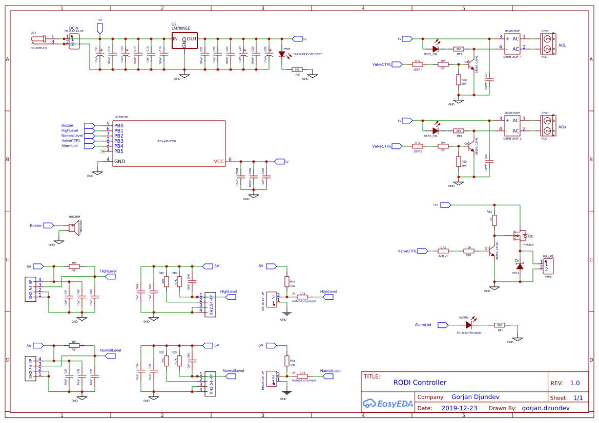
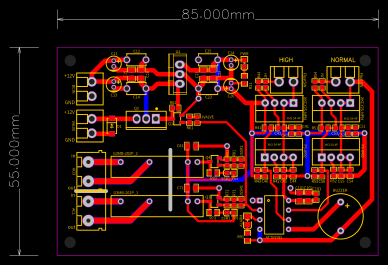

# RO Water Controller

# Abstract
This is an ATtiny85 electric valve controller for RO Water System.

# Functionality
* power supply stabilization from 12V to 5V
* power On/Off indicator
* two water level sensors:
    * one for the desired max level of RO water
    * one as a backup sensor if the main one fails
* three types of water level sensors supported for each sensor
    * float switch type
    * IR - infra red [`(FS-IR02)`](https://www.google.com/search?q=FS-IR02)
    * contact less [`(XKC.Y25.NPN)`](https://www.google.com/search?q=XKC.Y25.NPN)
* two types of output
    * 12V on/off for low voltage valve
    * 220V (live and neutral) on/off for high voltage valve
* alarm when the backup sensor is sensing liquid
    * alarm LED
    * alarm buzzer

# Thanks to
[Nick Gammon](https://stackexchange.com/users/6511685/nick-gammon) for his invaluable forum

# EasyEDA PCB Project
Check this link [ROWaterController](https://easyeda.com/gorjan.dzundev/rodicontroller_copy)
##### Electric scheme

##### PCB layout
