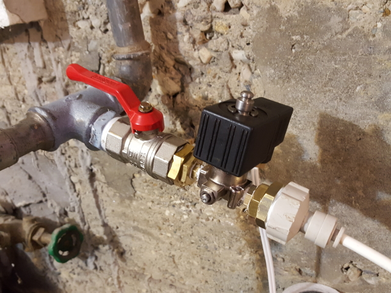
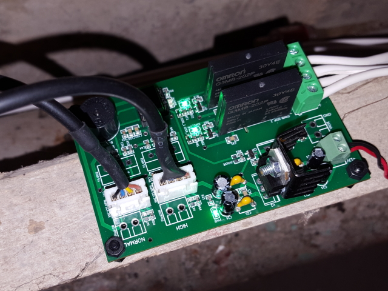
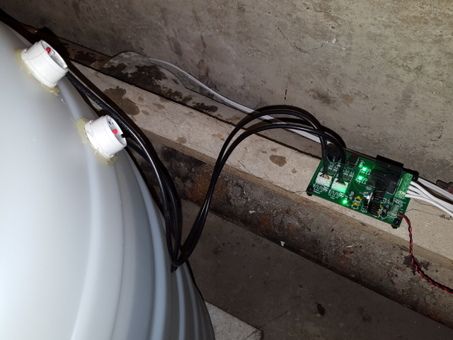
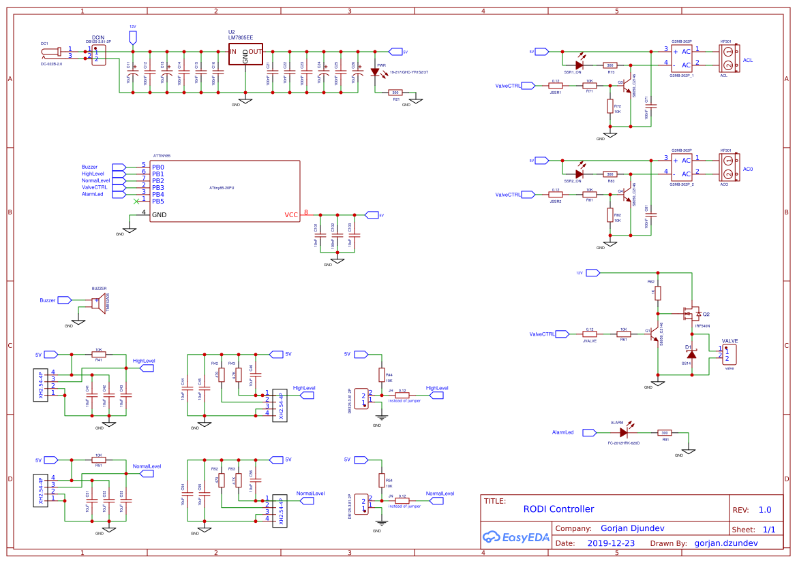
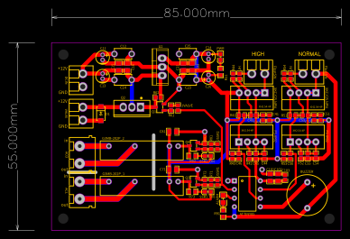

# RO Water Controller

## Abstract

This is an **ATtiny85-based automatic fill controller** for an RO/DI water reservoir. It monitors two independent water level sensors and controls an electric fill valve, with an LED/buzzer alarm if the backup sensor detects an overfill condition.

## Functionality

* power supply stabilization from 12V to 5V
* power On/Off indicator
* two water level sensors:
  * one for the desired max level of RO water ("normal" sensor)
  * one as an independent backup sensor if the main one fails ("high" sensor)
* three types of water level sensors supported for each sensor
  * float switches
  * IR - infra red [`(FS-IR02)`](https://www.google.com/search?q=FS-IR02)
  * contact-less [`(XKC.Y25.NPN)`](https://www.google.com/search?q=XKC.Y25.NPN)
* two types of output
  * 12V on/off for low voltage valve
  * 220V (live and neutral) on/off for high voltage valve
* alarm when the backup sensor is sensing liquid
  * alarm LED
  * alarm buzzer

## Pin map

ATtiny85, per `src/main/main.cpp`'s `Pins` namespace:

| Function | Arduino pin | ATtiny85 |
| --- | ---: | --- |
| Buzzer | `0` | PB0 |
| High sensor | `1` | PB1 |
| Normal sensor | `2` | PB2 |
| Valve | `3` | PB3 |
| Alarm LED | `4` | PB4 |
| Reset | `5` | PB5 |

PB5 stays RESET/programming. If hardware wiring changes, update `Pins` in `main.cpp` and verify against `doc/images/electric.png`.

## Control behavior

**Normal operation** - while the high sensor is *not* sensing water:

* alarm LED off, buzzer off;
* the normal sensor drives the valve: no water detected → valve **on**; water detected → valve **off**.

**High-level alarm** - the moment the high sensor detects water:

* the valve switches off **immediately**, bypassing the anti-chatter delay below (this path is safety-critical - see [Safety](#safety));
* the alarm LED turns on;
* the buzzer starts its pattern.

The high sensor always overrides the normal sensor - this is the device's core safety property.

**Sensor wiring** - both sensors are wired `INPUT_PULLUP`. Firmware semantics: **HIGH = sensing water, LOW = not sensing water**. Don't invert this without verifying the PCB's sensor interface - see `doc/images/electric.png`.

**Valve anti-chatter delay** - ordinary valve state changes (driven by the normal sensor) are held to a minimum 16-second gap between transitions, to avoid rapid on/off chatter if the water level hovers right at the sensor's threshold. The high-sensor safety path is exempt from this delay by design - it always switches the valve off immediately.

**Alarm pattern** - the buzzer runs a repeating on/off pattern (currently `700 / 400 / 700 / 400 / 1400 / 4000` ms, i.e. beep/pause/beep/pause/beep/long-pause, ~7.6s cycle) while the high sensor is active, and stops the instant it clears. The pattern array's length must stay **even** - the implementation toggles the buzzer pin at every interval boundary unconditionally, so an odd-length pattern would make each slot's on/off meaning flip on alternating repeats instead of staying fixed (enforced by a `static_assert` in `include/Buzzer.h`).

## Safety

* the high-level sensor is an **independent** hardware safety layer, not just a second reading of the same thing - it exists specifically to catch a failure of the normal sensor;
* the high-sensor path always uses an immediate, non-delayed valve shutoff;
* the firmware enables the ATtiny85's watchdog timer (2 second timeout) - `loop()` has no blocking calls and runs continuously, so a hang here is a bug, not normal operation, and the watchdog resets the MCU rather than leaving the valve stuck in whatever state it was last driven to;
* there is deliberately **no** maximum valve-open timeout - RO fill times run for hours and vary by tank size/membrane flow rate, and this firmware has no persistent config/serial console to tune a timeout value per installation, so a hardcoded one would either nuisance-trip or add negligible protection beyond the independent high sensor already described above;
* firmware is not the only flood/electrical safety layer this device relies on - see the PCB and enclosure for isolation/clearance/grounding between the low-voltage logic and any mains-voltage valve switching.

## Repository layout

```text
platformio.ini           # authoritative build config
CMakeLists.txt           # CLion/CMake build - navigation, and a working alternate build (see Build)
src/main/main.cpp        # composition root: pin map, wiring, setup()/loop()
include/                 # one header per class
  Buzzer.h
  Switchable.h
  SwitchableWithDelay.h
  WaterLevelSensor.h
test/
  controllerTest.cpp     # host-side regression tests, drives the real classes in include/
  ArduinoTestDouble.h    # minimal host stand-in for the Arduino functions those classes need
  CMakeLists.txt         # standalone host-native test project (see Testing)
doc/images/              # schematic, PCB, and hardware photos
```

## Build

**PlatformIO (authoritative):**

```bash
pio run -e usbasp                 # build
pio run -e usbasp -t upload       # build and upload
```

Target: ATtiny85, board `digispark-tiny`, programmer `usbasp` (see `platformio.ini`). Clock: the board's internal oscillator, **16.5 MHz** by PlatformIO's `digispark-tiny` board definition (no override in `platformio.ini`) - this is the value the actual production build compiles and links against.

**CMake (secondary):** mainly for CLion/editor navigation, but also produces a real, working build - resolves the AVR toolchain and Arduino core through PlatformIO's own installed packages (`~/.platformio` / `%USERPROFILE%\.platformio`), so no separate Arduino IDE install is required:

```bash
cmake -S . -B cmake-build-debug
cmake --build cmake-build-debug
```

If `pio run -e usbasp` and this CMake build ever disagree (flash/RAM usage, behavior), trust PlatformIO - it's authoritative.

## Testing

`test/controllerTest.cpp` drives the actual production classes from `include/` directly (via a minimal host-side Arduino-function stand-in with a fabricated clock, `test/ArduinoTestDouble.h`) rather than reimplementing them - so a passing test is evidence about the real firmware, not a copy of it. It's a separate, standalone CMake project (the AVR cross-compiler and the host compiler can't share one CMake configure):

```bash
cmake -S test -B test/cmake-build-debug
cmake --build test/cmake-build-debug
ctest --test-dir test/cmake-build-debug
```

Covers: buzzer start/repeat/stop and `millis()` rollover, the anti-chatter delay in both directions plus its immediate-bypass path, and sensor polarity. Does not cover `loop()`'s own if/else composition (e.g. "the high sensor overrides the normal one") - that's a few lines of directly-readable code sitting on top of the now-tested classes, not exercised through a host test.

## Thanks To

[Spence Konde (aka Dr. Azzy)](https://github.com/SpenceKonde) for the [Arduino core for ATtiny](https://github.com/SpenceKonde/ATTinyCore)

[Nick Gammon](https://stackexchange.com/users/6511685/nick-gammon) for his invaluable [Gammon Forum](https://www.gammon.com.au/scripts/forum.php)

## Device Under Test

### Electric Valve



### PCB



### PCB With Sensors



## EasyEDA PCB Project

Check this link [ROWaterController](https://easyeda.com/gorjan.dzundev/rodicontroller_copy)

### Electric scheme



### PCB layout


